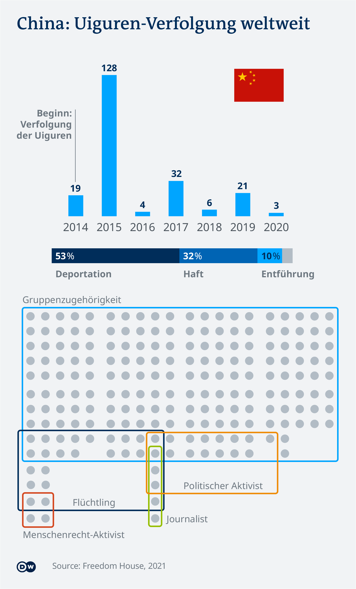

# Transnational Repression

_Idea:_  [Michel Penke](https://michelpenke.de)\
_Research, data analysis and data visualization:_  [Michel Penke](https://michelpenke.de)\
_Illustration:_ [Michel Penke](https://michelpenke.de)\
_Writing:_  [Michel Penke](https://michelpenke.de)

**Read the full articles on DW.com:**
- [How states hunt critics abroad](https://www.dw.com/en/how-states-hunt-critics-abroad/a-60685513)

State persecution across borders, so-called transnational repression, is a rising phenomenon in contemporary international relations. More than 30 countries unlawfully persecute opposition figures outside their own borders through abductions, arrests, deportations, and killings. Three states stand out in particular in breaking international law. 

The following text will explain the process behind this story: Which data sources were used, how the analysis was conducted and how the data was visualized.

# Source data

| **Data** | **Source** | **Link** |
| --- | --- | --- |
| # Out of Sight, Not Out of Reach | Freedom House| [Report](https://freedomhouse.org/report/transnational-repression#:~:text=What%20is%20Transnational%20Repression%3F,Interpol%20abuse%2C%20and%20family%20intimidation.) / Data was provided by Freedom House on the condition that it would not be further disseminated  |

# Analysis
### Tactics

The tactics used by the 31 countries with cross-border persecution were presented based on Freedom House's assessment. They do not indicate success or frequency. 

_Caveats: There are no data entries in the dataset for some tactics, such as "intimidation", for all designated countries. However, according to Freedom House, the entries in the database are a "snapshot" of a much larger number of incidents, from which they have taken only those for which there is strong evidence. Cases with weaker evidence were left out._

### Country profiles

Im Artikel erschienen drei Grafiken zu den weltweit aktivsten Länder China, Türkei und Ägypten. Auch hier wurden nur die durch Freedom House mit starker Evidenz bewerteten Fälle mit einbezogen. Entsprechend sind die Zahlen beispielsweise für die Türkei teilweise noch geringer als selbst von der Regierung publik gemacht. 

